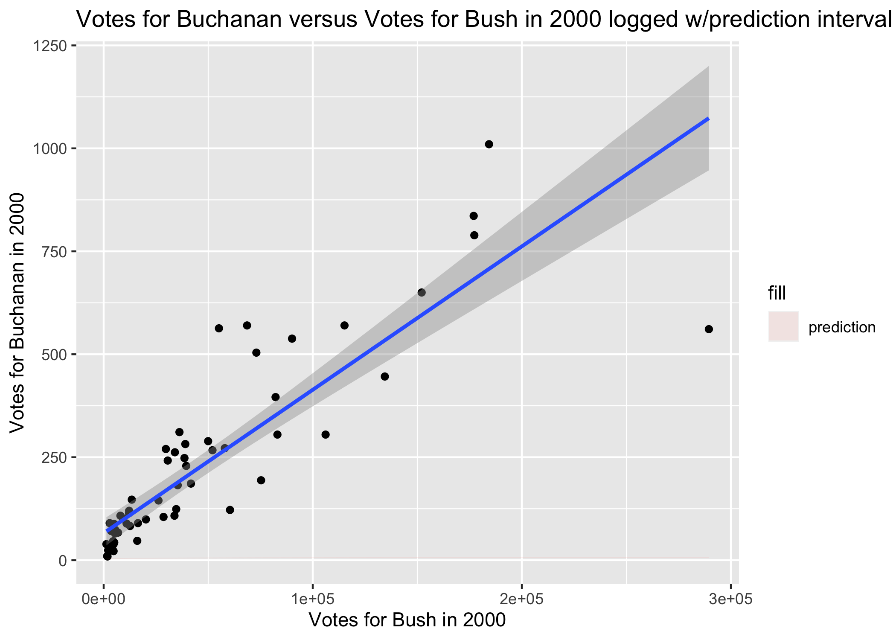

```{r setup, include=FALSE}
knitr::opts_chunk$set(echo = TRUE)
```
# Introduction

The 2000 US Presidential election of Al Gore versus George W. Bush was a very close competition, coming down to just a few hundred votes. The race came to a fraught and contentious end in the state of Florida, where the weight of America's future leadership fell upon heavily scrutinized county-level votes. In Palm Beach County, Democratic voters disputed ballot results, claiming that a confusing ballot design had caused voters to accidentally vote for Reform Party candidate Pat Buchanan instead of Gore. This report aims to analyze whether Buchanan received more votes than expected in Palm Beach County. We used data from all 67 counties in Florida in order to create a linear model of Bush votes versus Buchanan votes. We then created a 95% prediction interval to predict the number of Buchanan votes expected in Palm Beach County if no anomaly had occurred. 

# Results

In order to create a prediction interval using the data from the other 66 counties, I removed the disputed outlier (Palm Beach County) from the dataset and fit the regression of logged votes for Bush in 2000 against logged votes for Buchanan in 2000. Logging these variables brought the data closer to a linear model. 

```{r, echo = FALSE}

```

After taking the disputed outlier (Palm Beach County) out of the dataset and logging the variables, the equation for predicting Buchanan votes from Bush votes per county was: 

$$
(log(Buchanan2000) | log(Bush2000)) = -2.34149+0.73096 log(Bush2000) 
$$

with a prediction standard error of 0.4302319. 

With this model, we can use Palm Beach County's number of votes for Bush in 2000 (152846) to predict the number of votes Palm Beach County should have had for Buchanan. After unlogging the y outputs, the predicted number of Florida county-level votes for Buchanan with 152846 votes for Bush in 2000 is 592.368. 

We are 95% confident that a Florida county with 152846 votes for Bush in 2000 will have between 250.800 and 1399.16 votes for Buchanan. 

# Discussion

Our findings found that the observed number of Palm Beach County votes for Buchanan in 2000 rested outside the maximum end of the 95% prediction interval (1399.16) by 2007.84 votes. This indicates that Palm Beach County deviated from the trend of Buchanan and Bush votes in Florida Counties. However, this analysis is limited by the assumption that the relationship between Buchanan and Bush votes in this county is the same as in others in Florida. Other confounding variables outside of ballot design could have affected this deviation. 

# R Appendix

```{r, echo = FALSE}
library(Sleuth3)
library(ggplot2)
head(ex0825)

ex0825_no_Palm_Beach <- ex0825[-c(67), ] #excluding Palm Beach from the data frame
ex0825_no_Palm_Beach_lm <- lm(Buchanan2000 ~ Bush2000, data = ex0825_no_Palm_Beach) #creating a lm for this data frame

ggplot(ex0825_no_Palm_Beach, aes(x=Bush2000, y=Buchanan2000)) +
  geom_point() +
  geom_smooth(method = "lm", se = FALSE) +
  labs(x = "Votes for Bush in 2000", y = "Votes for Buchanan in 2000",
       title = "Votes for Buchanan versus Votes for Bush in 2000") #basic scatterplot w/out Palm Beach outlier 

options(repos = c(CRAN = "https://cloud.r-project.org"))
install.packages("ggResidpanel")
library(ggResidpanel)
resid_xpanel(ex0825_no_Palm_Beach_lm) #residual plot of the linear model w/out Palm Beach outlier

resid_panel(ex0825_no_Palm_Beach_lm, plots = c("qq", "hist")) #Q-Q plot and histogram

ggplot(ex0825_no_Palm_Beach, aes(x=Bush2000, y=Buchanan2000)) +
  geom_point() +
  geom_smooth(method = "lm", se = FALSE) +
  scale_y_log10() +
  scale_x_log10() +
  labs(x = "Votes for Bush in 2000 logged", y = "Votes for Buchanan in 2000 logged",
       title = "log transformed Votes for Buchanan versus Votes for Bush in 2000") #scatterplot for logged model

ex0825_no_Palm_Beach_logged_lm <- lm(log(Buchanan2000) ~ log(Bush2000), data = ex0825_no_Palm_Beach) #creating logged lm
resid_xpanel(ex0825_no_Palm_Beach_logged_lm) #checking assumptions

resid_panel(ex0825_no_Palm_Beach_logged_lm, plots = c("qq", "hist")) #checking assumptions

which(ex0825$County == "Palm Beach") #finding row # of the Palm Beach outlier

which(ex0825$Buchanan2000 > 3000) #checking to make sure Palm Beach is an outlier

df = data.frame(ex0825)
df[which(df$County == "Palm Beach"), ] #returning data frame with certain rows to see Palm Beach's x variables
```

```{r}
predict(ex0825_no_Palm_Beach_logged_lm,
        newdata = data.frame(Bush2000 = 152846),
        interval = "prediction",
        se.fit=T) #prediction for Palm Beach's Buchanan2000
  
se.pred <- sqrt(0.4198003^2 + 0.09416562^2) #calculating the SE for prediction

ex0825_pred <- data.frame(ex0825_no_Palm_Beach,
                          predict(ex0825_no_Palm_Beach_logged_lm, interval = "prediction")) #creating prediction model
head(ex0825_pred)
```

```{r plot_chunk, echo = FALSE}
plot <- ggplot(ex0825_pred, aes(x = Bush2000, y = Buchanan2000)) + #global x/y variables
  geom_point() + #plot data
  geom_ribbon( #add 'ribbon' geom for bands
    aes(ymin = lwr, #lower prediction bound at a given number of votes
        ymax = upr, #upper prediction bound at a given number of votes
        fill = "prediction"), #quick way to get a legend
    alpha = .1) + #makes ribbon more transparent
  geom_smooth(method = "lm") + #add linear model line
  labs(x = "Votes for Bush in 2000", y = "Votes for Buchanan in 2000",
       title = "Votes for Buchanan versus Votes for Bush in 2000 logged w/prediction interval")

ggsave("plot.png", plot, width = 7, height = 5)
```

```{r}
summary(ex0825_no_Palm_Beach_logged_lm)
```